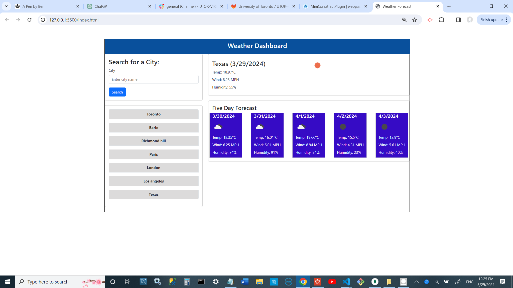

# Weather Forecast Dashboard

This program is a weather forecast dashboard that displays the current weather forecast and the next seven days forecast for a city. It also includes a "City History" section that displays cities that have been searched for previously.

## Features

- **Current Weather Forecast:** Displays the current weather information for a specific city.
- **Seven Day Forecast:** Displays the weather forecast for the next seven days for a specific city.
- **City History:** Keeps track of the cities that have been searched for and displays them in a list under the "City History" section.
- **Local Storage:** When a city is added to the "City History," it is appended to the local storage of cities. This ensures that the city list persists even after the page is refreshed.
- **Validation:** The submit button only accepts city names that truly exist. 

## Usage

1. Enter a city name in the search input field.
2. Click the "Search" button to display the weather forecast for that city.
3. The current weather information and the seven-day forecast will be displayed.
4. The city will be added to the "City History" section.
5. The city list will persist via local storage.

## Technologies Used

- HTML
- CSS
- JavaScript
- Bootstrap
- OpenWeatherMap API

## Demo

## deploy

To deploy the program locally, follow the link below:

deploy link:  https://bahman927.github.io/weather-challenge-6/weather-challenge-6/
